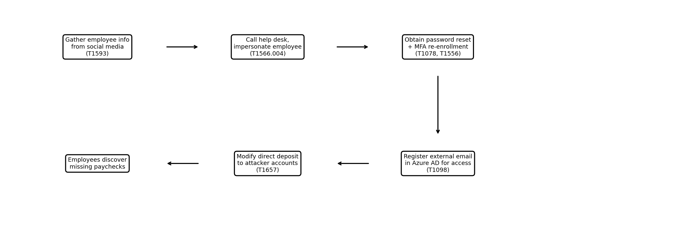

# Anatomy of an Attack: The Payroll Pirates and the Power of Social Engineering

[**https://unit42.paloaltonetworks.com/social-engineering-payroll-pirates/**](https://unit42.paloaltonetworks.com/social-engineering-payroll-pirates/)

## <u>Students</u>
- Aviv Heller
- Shaked Yakobi

## <u>Goal</u>

The attackers' objective was financial gain through payroll fraud. They used social engineering techniques, specifically voice phishing (vishing), to impersonate legitimate employees and trick IT help desk staff into resetting passwords and re-enrolling multi-factor authentication. Once they gained access to employee accounts, they navigated to the organization's payroll system and modified direct-deposit bank details, redirecting salary payments to bank accounts under the attackers' control.

## <u>Tactics, Techniques and the Behavior</u>
Here's a comprehensive list of the tactic, technique used
and the observed behavior ordered by the sequence of events.

**Tactic:** Reconnaissance\
**Technique:** [T1593](https://attack.mitre.org/techniques/T1593/) - Search Open Websites/Domains\
**Behavior:** Attackers gathered personal and professional information about target employees from social media platforms and public online profiles. This information was used to build convincing impersonation profiles, enabling them to pass identity verification when contacting the help desk.

**Tactic:** Initial Access\
**Technique:** [T1566.004](https://attack.mitre.org/techniques/T1566/004/) - Phishing: Voice Phishing\
**Behavior:** Attackers called the IT help desk pretending to be employees, using the personal details they had gathered during reconnaissance to pass challenge-response authentication. They used this social engineering to request password resets and account recovery.

**Tactic:** Credential Access\
**Technique:** [T1078](https://attack.mitre.org/techniques/T1078/) - Valid Accounts\
**Behavior:** Through the help desk calls, attackers successfully obtained password resets and gained legitimate credentials to employee accounts. They then used these valid credentials to log in to internal systems without triggering security alerts.

**Tactic:** Defense Evasion\
**Technique:** [T1556](https://attack.mitre.org/techniques/T1556/) - Modify Authentication Process\
**Behavior:** Attackers bypassed multi-factor authentication by convincing the help desk to re-enroll MFA on an attacker-controlled device. This allowed them to complete authentication flows without the real employee's phone or authenticator app.

**Tactic:** Persistence\
**Technique:** [T1098](https://attack.mitre.org/techniques/T1098/) - Account Manipulation\
**Behavior:** Attackers registered an external email address as an authentication method for a service account within the organization's Azure AD environment. This gave them a persistent backdoor to regain access even if the original compromised passwords were changed.

**Tactic:** Impact\
**Technique:** [T1657](https://attack.mitre.org/techniques/T1657/) - Financial Theft\
**Behavior:** Attackers modified direct-deposit details for multiple employees in the payroll system, redirecting their paychecks to bank accounts under the attackers' control. The fraud was only discovered when employees reported missing salary payments.

## <u>End Results</u>
The attackers successfully redirected salary payments from multiple employees to their own bank accounts. The breach was discovered only after employees noticed their paychecks were missing. This attack demonstrates how social engineering can completely bypass technical security controls like MFA, and highlights the critical importance of having strong, multi-step identity verification procedures at help desks that go beyond simple knowledge-based questions.
